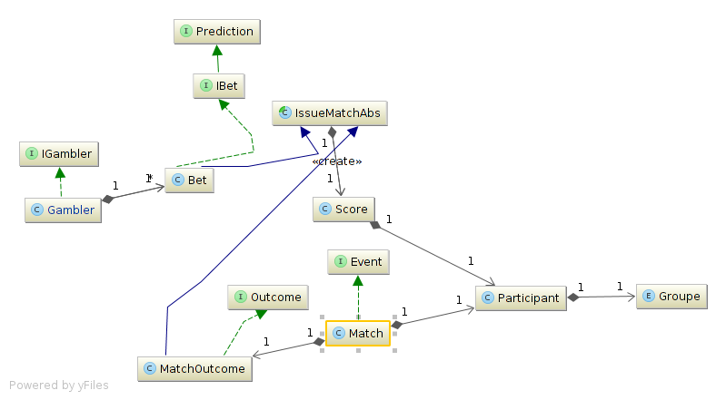

Architecture
==========

This document is useful to developers who wish to understand the architecture of the application.

zenfoot is using :
 - Google App Engine tools for the database. Data is stored in the datastore, and mapped with Objectify open source ORM.
 - [RestX](https://github.com/Restx/restx), the REST framework created by Xavier Hanin for the API
 - AngularJS and Bootstrap 3 for the client

# Model architecture

## Java model

Here is a class diagram of the model we are using for our application.

The gambler is what contains most of the information. It is different from the user object which is instantiated by RestX.
Gamblers contain a list of Bets.

Some elements which are important to understand the model :

We complicated the model a little bit to take into account that our application might offer different kinds of bets :
So far a gambler can bet on the result of a match, but a possible extension is to allow him to bet on a competition.

 a bet contains a reference to a match (it contains the id of a match).
 It also contains a reference to an outcome, which is the representation of the result of an event.

 So far we are only dealing with matchs and bets on matchs, so a Bet a bet on a match. We used an abstract class to represent
 a Bet and a MatchOutCome, as a Bet is a guess of what the outcome of a match is. This implies the java model for a Bet and
 and MatchOutCome has many similarities (it consists of the scores of the two participating teams).

## DataBase

 We use objectify v5 to map our objects to the datastore
 Use gae.dao.OfyService to register a new class. You can then create a DAO for each kind of object you need to register,
 a repository containing an instance of that DAO, and a corresponding service containing the repository. We use RestX dependency
 injection system to inject instances.

 ## Restx dependency injection
 Have a look at gae.module.ModelModule to understand how RestX dependency injection is used. The link to RestX documentation is
 below this document, in documentation section.

## Rest resource

 The resource we are using is module.BetResource class.
 Note that @RolesAllowed enables us to allow access to our resources according to the role of the user that's requesting it.

 The "/matchbets" resource is what retrieves all the matches and the gambler object with all its bets. It returns a list of MatchBet
 object, which is a simple way to bind a match and its corresponding bet server side.
 
 The flow is the following :
 
 the connected gambler is retrieved --> if it doesn't exist, it's created with all its bets object --> new bets are added if new matches
 have been added to the list ---> The list of MatchAndBet is created and sent.

 The "/bets" resource allows the gambler to post its bets.
 
 The flow is the following :
 
 the connected gambler is retrieved --> the list of bets is passed to the GamblerService which checks that the match has not started -->
 if it hasn't, it updates the bet, if it had, it doesn't update it

## Client
The client is developed using angular. To modify it, access static resources in src/main/webapp/

The angular code is in js/app. The rest is simple separation between directive, controllers, services and so on.
The controller for the main gambler page is called MatchCtrl and you can find it in app/controllers/controller.js
The corresponding html page is in view/index-content.html.
Note that we are using ui-router to manage the routing of pages.

## Documentation

### RestX
[RestX documentation](http://restx.io/docs/)

### Google App Engine
[datastore documentation](https://developers.google.com/appengine/docs/java/datastore/)

### Objectify
[objectify v5 documentation](https://code.google.com/p/objectify-appengine/wiki/Introduction)
[The javadoc](http://docs.objectify-appengine.googlecode.com/git/apidocs/index.html)
